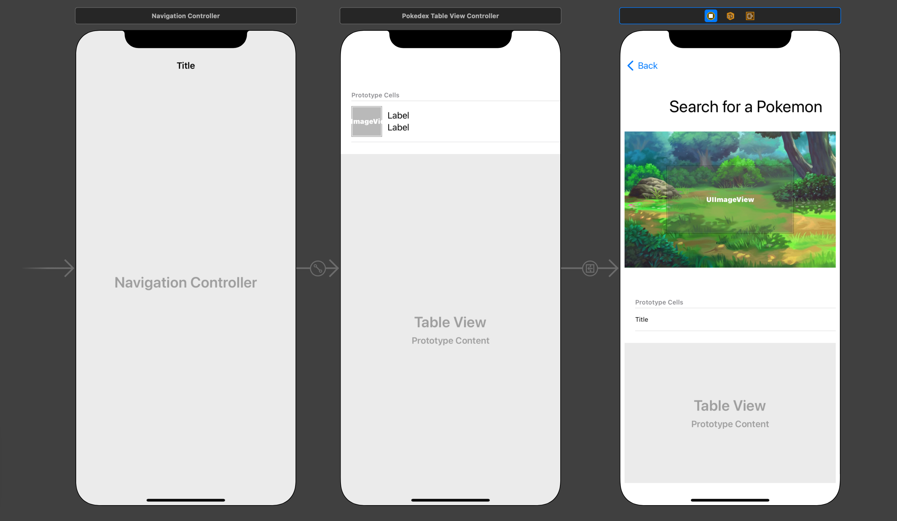

#  Pokedex Codable w/ Result Type
In this project, you will use your knowledge of Swift and Networking to build an app that displays the search results for Pokemon! Gotta parse em’ all!

Students who complete this project independently or as a pairing will showcase their understanding of the following principles:

* Basic Storyboard constraints
* UITableviews
* Creating Custom `class` objects
* Constants, Variables, and Basic Data Types
* Collections
* Functions
* Control Flow
* IBActions && IBOutlets
* API Calls
* API Documentation

---

##  Before you begin

This project will build off the project you completed today with the afternoon lecture. If you do not have a viable starting project please follow the instructions below. Otherwise, you can skip this section! Pokemon await!

Please `Fork` then `clone` the repo. You can access the repo here:
[GitHub - Stateful-Academy/Pokedex_Codable](https://github.com/Stateful-Academy/Pokedex_Codable)

Create a local branch named `pairedProject_starter` and track the remote branch `pairedProject_starter`. 

To do this:
 * Open `Terminal`
 * Navigate to the correct `directory`
 * Type `git checkout --track origin/pairedProject_starter` 
	 * Hype

Build and run the app to discover what your code has been completed for you. Review the storyboard, and all the controllers before progressing.

---

## Design
The goal of our project is to be able to select a `cell` from the `PokedexTableViewControlelr` and navigate to the detail screen we completed a few weeks ago. We will only need to make a few minor changes to the layout of our scenes. 

Navigate to the `Main.storyboard` file. Using the image below as a guide update your scene.

A few items we’d like to highlight:
1. Notice there is a `UINavigationController`
2. Notice that there is a segue
3. After removing the `searchBar` 
		1. Give the `stackView`  which holds the `pokemonIDLabel` and `pokemonNameLabel`  a constraint for its `top`
		2. Align `Top` to `Safe Area Top` with a constant of `30` points
		3. Everything else should lock back into place

Make a commit when you’ve completed this step
___

## Updated Model
For this project to work properly, we need to `parse` additional data from the `pokeAPI`. Specifically, we need to access two properties:
 * `name` property for the `ability`
 * The `next` property which is a `String` that we can convert to a `URL`
 
Update your Model accordingly.

---

### Segue

Our plan is to use the `Segue` we created from the `cell`  to pass a `Pokemon` object to the `PokemonViewController`. However, for that to succeed we need something to `catch` that data when it’s sent. Luckily, we already have an `optional` `Pokemon:Pokemon` constant that is just waiting for a value!

* Uncomment the `prepare(for segue: UIStoryboardSegue, sender:Any?)` function.

Within the body of this function, we need to double-check a few items before we can pass the `Pokemon` object to the `PokemonViewController`. 

We first need to know what segue was triggered. If that was the one we expected we need to know if the `destination` of that `segue` is where we are trying to go - the `PokemonViewController`.

If it is, then we need to know what `cell` the user tapped on so we can find the corresponding `book` object in our array. Once we have that we can pass that data along. Let's write the code that matches our goals:

1. Create a conditional that checks if the `segue.identifier` is equal to the `String` you set for the identifier of the `segue` we made on the `Interface Builder`
	1. If you haven’t done that.. you should
2. If that is true, conditionally typecast the `segue. destination`  `as?` the type of `ViewController` we aim to move the data to.
3. On the same conditional let's unwrap the `indexPath` for the selected row
	1. This is given to us by the `tableview`
4. Using that `indexPath`  assign the corresponding value from the `pokedexResults` array to a new constant named `pokemonToSend`
5. Call your `fetchPokemon(with:` function and pass in the `url` from the `pokemonToSend`
6. Press enter on the `autocompletable` block of your closure
	1. Name the value your `completion` will complete with `result`
		1. `switch` on the result and handle your two cases
			1. `success`
				1. Assign the `pokemon` property of the `destination` to the value of `pokemon` from the `.successful` case.
				2. ^ This needs to take place on the `main` thread.
			2. `failure`
				1. `print(“There was an error!”, error.errorDescription!)`

Well done! You just rocked *another* segue! Commit your changes and take a 15 min walk around. When was the last time you saw the sun?

---

### Updated Detail View

With our `segue` complete we are now ready to complete the changes to our `PokemonViewController`. We don’t need to make too many changes, but before we begin let’s delete all the code we no longer need.

1. Delete
	1. Search Bar Outlet
	2. Search Bar Protocol Adoption and Conformance
	

Perfect! Now we have some room to breathe. We need to update our `updateViews(with` function now that we have a `Pokemon` being passed to us via the `segue`. To do this we need to:

1. Update the `updateViews(with)` function to no longer have a parameter.
2. Update the `optional` `Pokemon:Pokemon` to have a `didSet` property observer.
	1. [Properties — The Swift Programming Language (Swift 5.6)](https://docs.swift.org/swift-book/LanguageGuide/Properties.html)
	2. Call the `updateViews()` method
3. Within the `updateViews` function we need to:
	1. Unwrap the `pokemon`
	2. Call the `fetchImage(for:)` method and pass in the string path for the `sprite` we hope to display
		1. Use the unwrapped `pokemon` and dot syntax to access the `sprite` path you want
			1. I like `.frontShiny`…
	3. Handle the `result`
		1.  `switch` on the result and handle your two cases
			1. `success`
				1. Assign the proper values to your `IBOutlet`s
				2. Reload the `pokemonMoveTableView`
			2. `failure`
				1. `print(“There was an error!”, error.errorDescription!)`

The last item of business on this screen is to update how we access the `name` of the `move` in the `cellForRow(at:)`. I’ll leave this one up to you.

You must be weary, friend. Make a commit and rest here, skeleton.

---

###  Pagination

For our last trick, we will use the API’s built-in functionality to fetch the `next` url once the user has scrolled to the bottom of the `PokedexTableView`. Take a moment to think about what `logic` needs to happen. 

* We need to know when the user is close to the end of the visible cells
	* What locally can you use to know if they are near the end of their `collection`
* We need to make a new network call for the next set of results
	* How will these results be added to the `collection`?
* When should we reload the `tableView`?

Let’s dive into the project on the `PokedexTableViewController` and write code to match the logic we’ve laid out.

* We need to know when the user is close to the end of the visible cells
	* UITableviews have more built-in functions than just the `cellForRow)at:)` and `numberOfRows` we’ve been using…
	1. Access the `willDisplay(cell:)` method
		1. Just start typing `willDisplay… ` and a popup should display and allow you to `auto complete` the rest of the function.

* What locally can you use to know if they are near the end of their `collection`
	1. Create a constant named `lastPokedexIndex` and assign the value of the `collection`’s count, less one.

* We need to make a new network call for the next set of results.
	* Take a moment and reflect on where the `value` of the next url is stored.
	* How do we get access to a `pokedex` property out of the scope of any `function`?
		* Solve this challenge before you move on..
1. Navigate back to the `willDisplay(cell:)` method
	1. Is this a hint? 🦋
2. Unwrap the solution to the problem we laid out above along with the value of `SPOILER.next` 
3. Call your `fetchPokemon(with:` function and pass in the `url` you just unwrapped.
4. Press enter on the `autocompletable` block of your closure
	1. Name the value your `completion` will complete with `result`
		1. `switch` on the result and handle your two cases
			1. `success`
				1. Replace the local  `pokedex` property with the value `Pokedex` received via the closure.
				2. Append the local `pokedexResults` property with the value of the `results` from the `Pokedex` received via the closure.
				3. Reload the `tableView`
					1. All UI Updates must be on the `main` thread
			2. `failure`
				1. `print(“There was an error!”, error.errorDescription!)`
 

Build and run! You should now have a working Pokedex! Great work. You sure `parsed`em` all!
---
